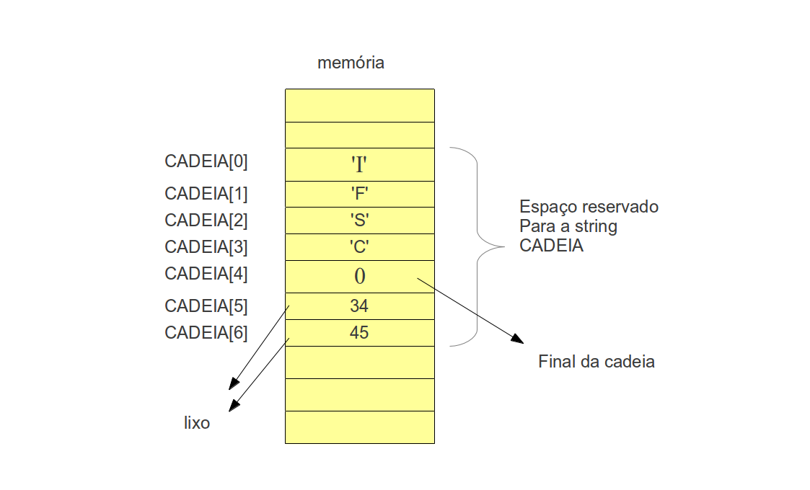

Repositório para a disciplinca de Sistemas Operacionais.


### aritmética de indíces (also known as ARitmética de Ponteiros)
```

void concatenar(char palavra1[], char palavra2[], char resultado[]){
    int tamanho1 = strlen(palavra1);

    // Copia palavra1 inteira para resultado
    strcpy(resultado, palavra1);

    // Copia palavra2 a partir da posição final de palavra1
    strcpy(resultado + tamanho1, palavra2);
}
```
aqui o usamos a ritmética de indices nas funções. O nome das funções representam suas posições na memória.

## Operadores de Ponteiros

Resumo dos operadores de ponteiros em C:
<pre>
& → pega o endereço

'* → acessa o conteúdo apontado

+, -, ++, -- → aritmética de ponteiros

==, !=, <, > … → comparação de endereços

-> → acesso a membros de struct via ponteiro
</pre>

## Struct e class

Em C são tipos compostos de dados, parecido com objetos. Não são objetos, embora sejam muito parecidos:
<pre>
Objeto → conceito da POO (programação orientada a objetos), tem estado (atributos) e comportamento (métodos).

Struct em C → só agrupa variáveis, não tem funções “dentro” dele.
(Você pode escrever funções que recebem um struct como parâmetro, mas elas ficam fora do struct.)
</pre>

A diferença aqui é que eles não possuem funções. Essa é uma diferença categorica entre o C e o C++, já que na segunda linguagem podemos ter métodos dentro dessas entidades. 

Exemplo de Struct:

```
struct Pessoa {
    int idade;
    float altura;
};
```
Dentro de C++ encontramos além do struct um outro tipo de entidade chamada de class. No C++, struct e class são quase a mesma coisa. Ambos podem ter atributos e métodos. A única diferença é que:
- Por padrão, os membros de struct são public.
- Por padrão, os membros de class são private.

Ou seja, em C++ um struct pode sim ser um objeto, porque a linguagem é orientada a objetos.

No nosos exemplo usando ponteiros:
```
struct Pessoa { int idade; };
struct Pessoa p = {20};
struct Pessoa *ptr = &p;

printf("%d", ptr->idade);   // acessa o campo idade
```
Acima, a ultima linha seria o nosso equivalente em java à

```
printf("%d", ptr.idade);
```

## String de caracteres
O zero no final da string é uma forma de indicar que a mesma termina sem necessidade de armazenar o tamanho dela (algumas linguagens fazem isto).




https://wiki.sj.ifsc.edu.br/images/2/2a/ExplicacaoString1.jpg


Abaixo temos um vetor de char:

```
#include <stdio.h>
int main ()
{
   char alfa[50];

   int i=0;

   printf ("Entre com a cadeia: ");
   scanf("%s",alfa);
   while(alfa[i]!=0)
      i++;
   printf ("\nNumero de caracteres em %s = %d \n", alfa, i);
   return 0;
}
```
O código acima tem alguns problemas:
- 1: O scanf NÃO testa se o buffer usado para leitura comporta a string. Isto pode ser uma fonte GRAVE de problemas.
- 2: O scanf usa o espaço branco para separar strings na leitura. Para evitar isto pode-se usar scanf("%[^\n]s",alfa)
- 3: A função gets pode também ser usada para leitura de strings mas a NOTA 1 se aplica também.

Existe uma sequência de controle mais flexível que o %s: o %[].

```
#include <stdio.h>

int main()
{
    char buffer[10];
    printf ("Entre com uma string\n");
    scanf ("%9[^\n]s", buffer);
    printf ("%s\n", buffer);
    return 0;
}
```

